# OneHealth

> Smart medication safety — detect dangerous drug interactions, including foreign & international medicines.

OneHealth was built as a hackathon MVP addressing a real clinical gap: doctors cannot easily identify drug-drug interactions (DDI) between foreign medicines and US medicines, and patients often take OTC drugs without knowing about dangerous combinations.

---

## Screenshots

### Patient iOS App

| Login | Register | Dashboard |
|-------|----------|-----------|
| 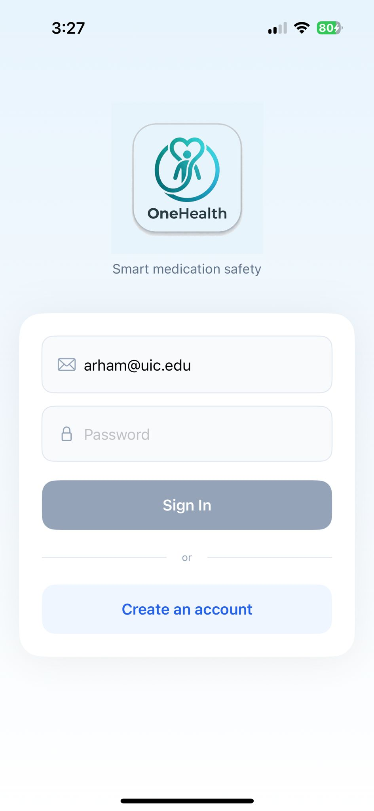 | 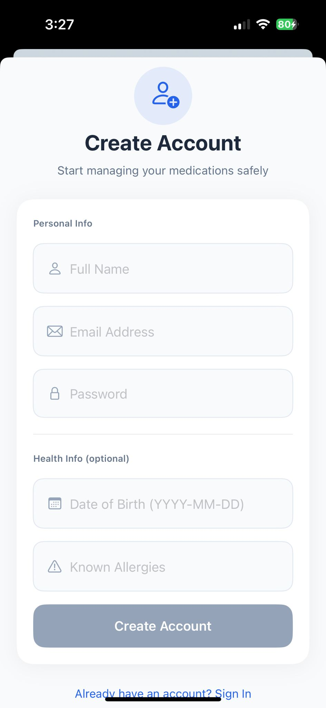 | 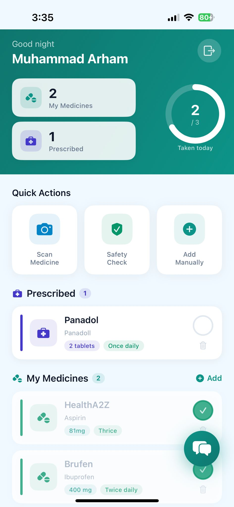 |

| Scan Medicine | Safety Check | Add Medicine |
|---------------|--------------|--------------|
| 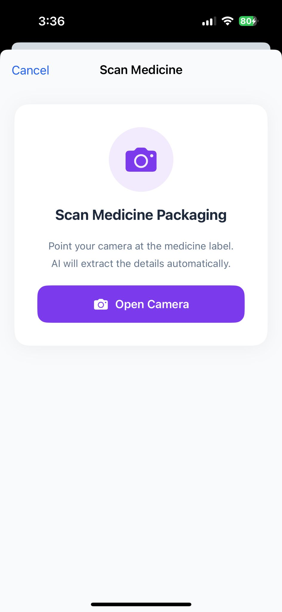 | 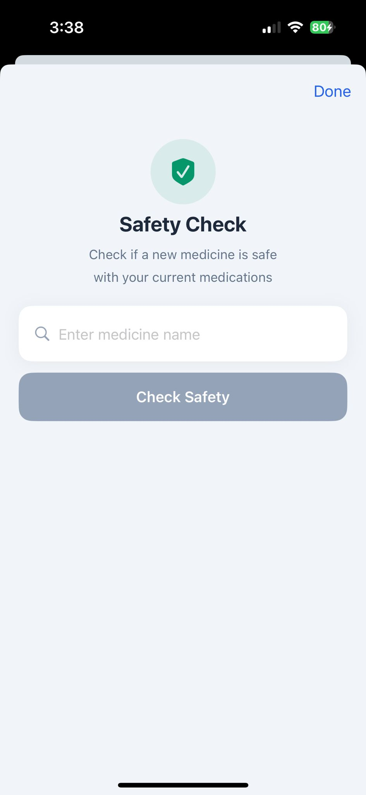 | 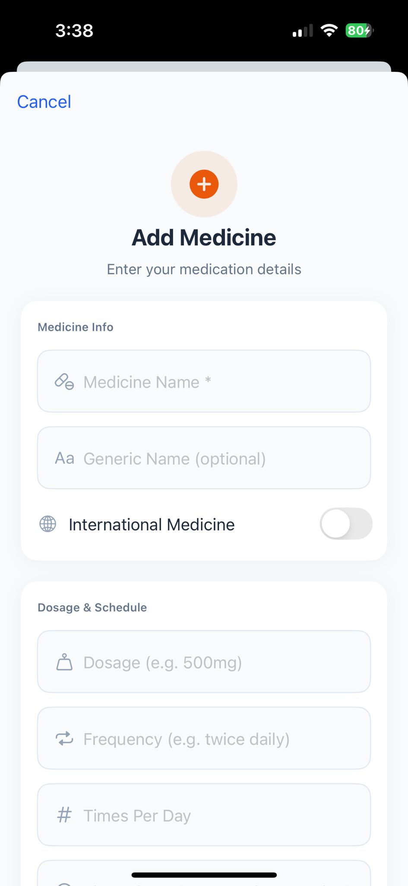 |

| Safety Check Result | Interaction Detail | DDI Warning Banner |
|---------------------|--------------------|--------------------|
| 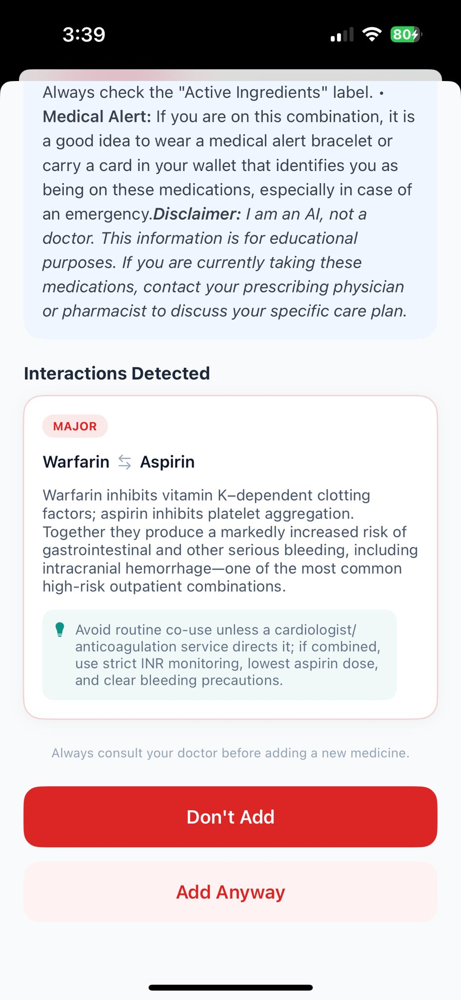 | 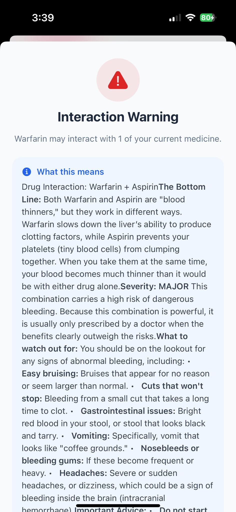 | 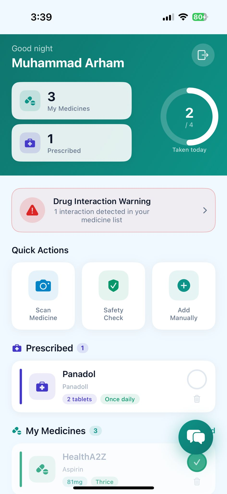 |

| Medicine Detail | AI Assistant | All Taken! |
|-----------------|--------------|------------|
| 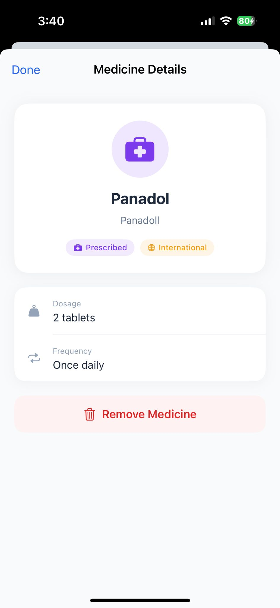 | 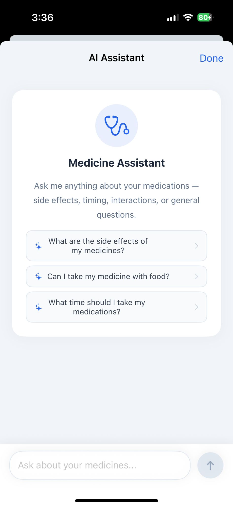 | 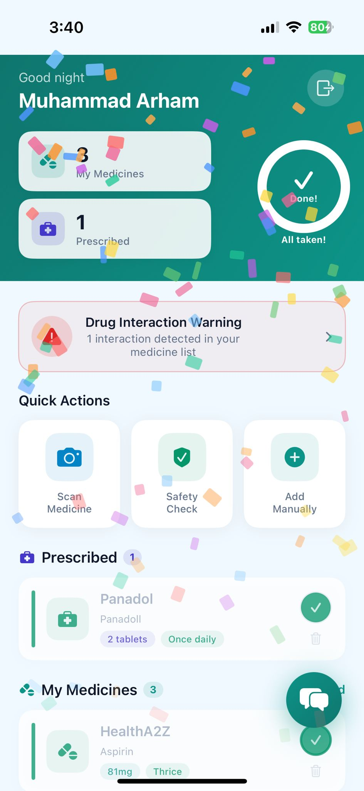 |

---

### Doctor Web App

| Login | Patients & Medicines |
|-------|----------------------|
| 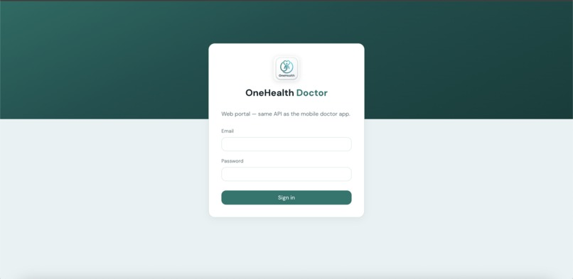 | 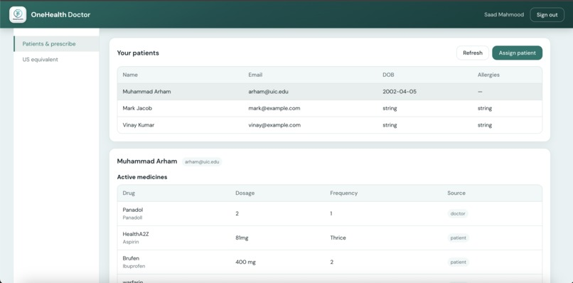 |

| Prescribe + DDI Block | US Equivalent Lookup |
|-----------------------|----------------------|
| 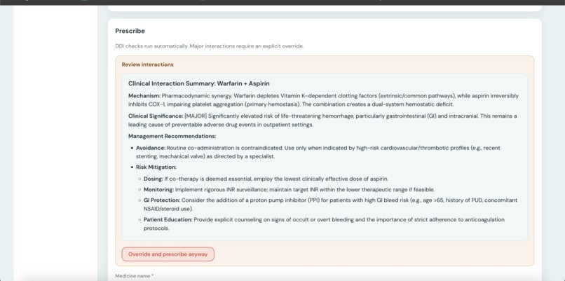 | 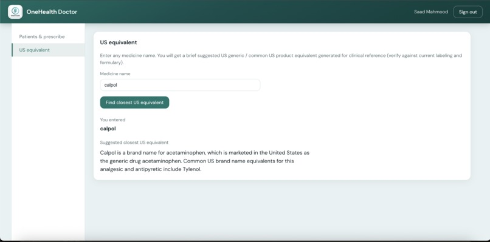 |

---

## The Problem

- Immigrants and travelers carry medicines from their home countries with brand names unrecognized in the US (e.g. Panadol, Brufen, Calpol).
- These foreign medicines interact with US-prescribed drugs, but existing DDI tools don't recognize them.
- Patients self-medicate OTC drugs without knowing what they already take could react badly.

---

## Solution

Two separate frontends sharing one backend API:

| User | Platform | Purpose |
|------|----------|---------|
| Patient | iOS App (Swift) | Track medicines, scan packaging, check safety, AI chatbot |
| Doctor | Web App (React) | Manage patients, prescribe with DDI check, look up US equivalents |

---

## Features

### Patient iOS App

- **Login / Register** — email, password, optional health info (DOB, known allergies)
- **Dashboard** — see prescribed and self-added medicines, daily taken tracker, confetti celebration when all taken
- **Drug Interaction Warning** — automatic banner if any interaction is detected in your active medicine list
- **Scan Medicine** — point camera at packaging label; AI (Claude) extracts medicine name and details automatically
- **Safety Check** — type a new medicine name to check if it's safe against your current medicine list before taking it
- **Add Manually** — add any medicine with name, generic name, dosage, frequency, and an "International Medicine" flag
- **Medicine Detail** — view tags (Prescribed / International), dosage, frequency, remove option
- **AI Assistant** — chatbot powered by Claude for plain-language questions about your medicines (side effects, timing, interactions)

### Doctor Web App

- **Login** — separate portal, same backend API
- **Patient List** — view all assigned patients and their active medicines (source: doctor-prescribed vs patient-added)
- **Prescribe** — fill medicine name, generic name, dosage, frequency, duration, notes; DDI check runs automatically
- **DDI Block** — if a major interaction is detected, prescription is blocked with a full Clinical Interaction Summary (mechanism, severity, management recommendations); doctor can explicitly override with "Override and prescribe anyway"
- **Prescription History** — per-patient log of past prescriptions
- **US Equivalent Lookup** — enter any foreign medicine name; Claude returns the closest US generic/brand equivalent for clinical reference

---

## Tech Stack

| Layer | Technology |
|-------|-----------|
| iOS App | Swift + SwiftUI |
| Doctor Web | React (separate repo) |
| Backend API | Python + FastAPI |
| Database | PostgreSQL (AWS EC2) |
| Authentication | JWT with role-based access (patient / doctor) |
| AI / LLM | Claude API (`claude-sonnet-4-6`) |
| DDI Engine | DrugBank (primary) + DDInter 2.0 (fallback) |
| Drug Normalization | RxNorm (NIH) — free |
| Drug Labels | DailyMed (NIH) — free |
| Adverse Events | OpenFDA — free |
| Hosting | AWS EC2 |

---

## Architecture

```
OneHealth/
├── onehealth-backend/        # Shared FastAPI server
│   ├── main.py
│   ├── config.py
│   ├── database.py
│   ├── auth/
│   │   ├── jwt.py            # JWT token handling
│   │   └── rbac.py           # Role-based access (patient / doctor)
│   ├── models/
│   │   ├── user.py
│   │   ├── medicine.py
│   │   ├── patient_medicine.py
│   │   └── prescription.py
│   ├── routers/
│   │   ├── auth.py           # Register, login
│   │   ├── patient.py        # Patient-facing endpoints
│   │   └── doctor.py         # Doctor-facing endpoints
│   └── services/
│       ├── llm.py            # Claude API — photo extraction, chatbot, DDI explanation, US equivalent
│       ├── drugbank.py       # DDI lookup (primary)
│       ├── ddinter.py        # DDI lookup (fallback)
│       ├── rxnorm.py         # Drug name normalization
│       ├── dailymed.py       # Drug label / composition data
│       └── openfda.py        # Adverse event data
│
└── OneHealthApp/             # iOS SwiftUI app (patients only)
    └── OneHealthApp/
        ├── App/
        ├── Auth/             # LoginView, RegisterView, AuthViewModel
        ├── Models/           # Shared data models
        ├── Network/          # APIService (all HTTP calls)
        └── Patient/
            ├── ViewModels/   # PatientViewModel
            └── Views/        # Dashboard, Scan, Safety Check, Add Medicine,
                              # Chatbot, DDI Warning Sheet, Medicine Detail
```

---

## Key Design Decisions

- **DDI logic uses structured databases, not LLM.** DrugBank/DDInter are authoritative sources. Claude only explains the result in plain language.
- **Doctor force override.** A doctor can override a major DDI warning — the override is logged in the prescription record.
- **International medicine flag.** Patients can mark a medicine as international; this is passed to the DDI engine for foreign drug resolution via RxNorm.
- **Role-based JWT.** Same backend, same `/auth/login` endpoint — role in token determines what the user can access.

---

## Backend Setup

```bash
cd onehealth-backend
python -m venv venv
source venv/bin/activate
pip install -r requirements.txt
cp .env.example .env
# fill in .env with your DB URL, Claude API key, DrugBank key
uvicorn main:app --reload
```

---

## iOS App Setup

Open `OneHealthApp/OneHealthApp.xcodeproj` in Xcode, set the backend URL in `Network/APIService.swift`, and run on a simulator or device (iOS 17+).

---

## Hackathon Note

Built for a HealthTech hackathon. DrugBank free tier is used — commercial use requires a paid DrugBank license.
